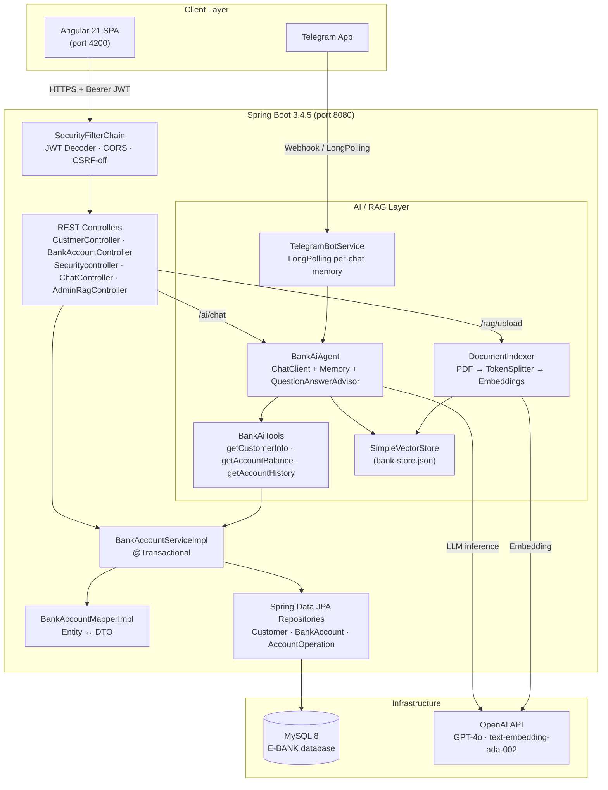
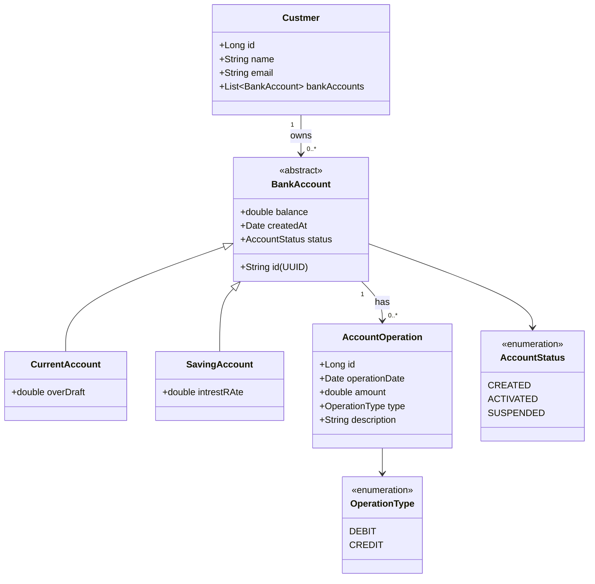
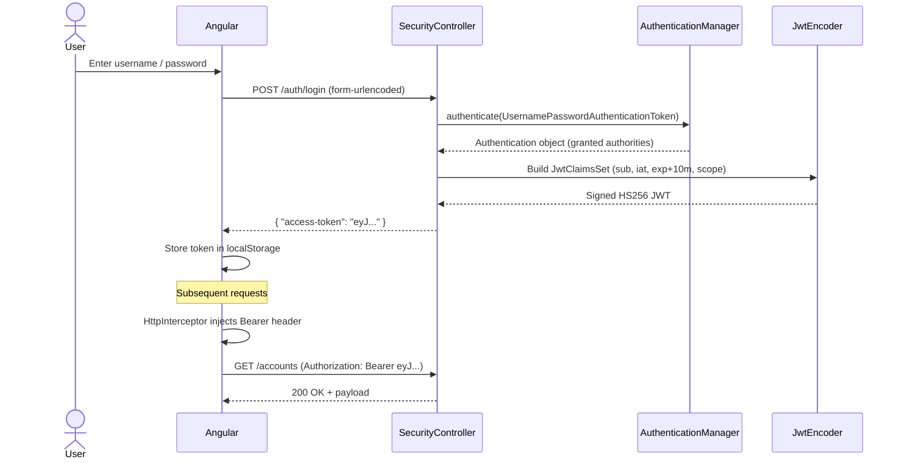
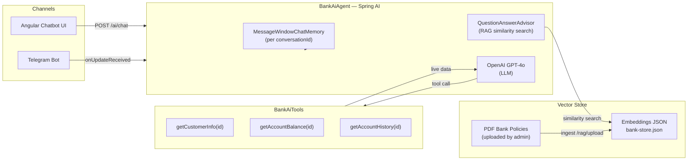
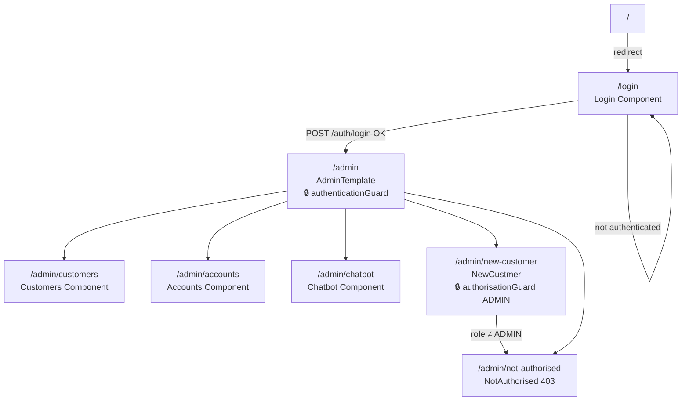
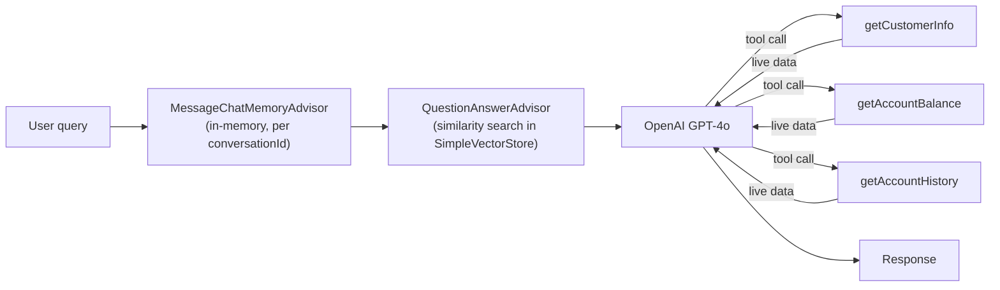
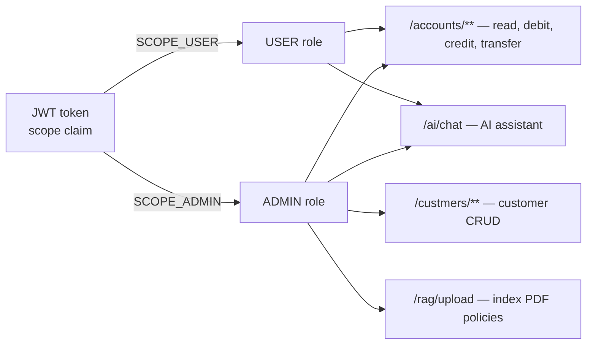

# E-Banking Full-Stack Application

> Technical documentation & project report

| Field | Value |
|---|---|
| **Student** | TOUBANI BADR EDDINE |
| **Professor** | ELLYOUSSFI MOHAMMED |
| **School** | ENSET |
| **Module** | Architecture JEE et Middleware |
| **Filière** | SDIA |

---

## Table of Contents

1. [Project Overview](#1-project-overview)
2. [Functional Scope](#2-functional-scope)
3. [Architecture](#3-architecture)
4. [Technology Stack](#4-technology-stack)
5. [Backend — Spring Boot](#5-backend--spring-boot)
   - [Project Structure](#51-project-structure)
   - [Domain Model](#52-domain-model-entities)
   - [Data Transfer Objects](#53-data-transfer-objects-dtos)
   - [Service Layer](#54-service-layer)
   - [REST Controllers](#55-rest-controllers)
   - [Security (JWT)](#56-security-jwt--oauth2-resource-server)
   - [AI Agent & RAG](#57-ai-agent--rag)
   - [Telegram Bot](#58-telegram-bot)
   - [Database & Configuration](#59-database--configuration)
6. [Frontend — Angular 21](#6-frontend--angular-21)
   - [Project Structure](#61-project-structure)
   - [Routing & Lazy Loading](#62-routing--lazy-loading)
   - [Authentication Service](#63-authentication-service)
   - [Route Guards & Interceptor](#64-route-guards--http-interceptor)
   - [AI Chatbot Component](#65-ai-chatbot-component)
7. [Security Model & Roles](#7-security-model--roles)
8. [REST API Reference](#8-rest-api-reference)
9. [Installation & Run](#9-installation--run)
10. [Default Users & Test Data](#10-default-users--test-data)

---

## 1. Project Overview

A **full-stack e-banking application** built for the *Architecture JEE et Middleware* module at ENSET. It covers customer and account management, financial operations, JWT-secured REST APIs, and an embedded **AI assistant** powered by Spring AI (OpenAI GPT-4o + RAG over bank documents) with a live chat UI and a Telegram bot interface.

The backend follows a clean **N-tier layered architecture** (REST → Service → Repository → JPA/MySQL). Authentication is stateless JWT, enforced by Spring Security's OAuth2 Resource Server. The Angular SPA communicates with the backend through a JWT-injecting HTTP interceptor and enforces route-level authorization via Angular guards.

---

## 2. Functional Scope

| Domain | Features |
|---|---|
| **Customers** | List, search, create, update, delete (admin only) |
| **Accounts** | Current & saving accounts auto-created per customer |
| **Operations** | Debit, credit, transfer between accounts |
| **History** | Paginated operation history per account |
| **Auth** | Login → JWT issued with embedded scopes |
| **AI Assistant** | Natural-language banking queries (balances, history, bank rules) |
| **RAG** | Admin uploads PDF policies → indexed into vector store → used by AI |
| **Telegram** | Same AI agent exposed on a Telegram bot channel |

---

## 3. Architecture

### 3.1 System Overview



### 3.2 Domain Model



### 3.3 JWT Authentication Flow



### 3.4 AI Agent Flow



### 3.5 Angular Routing



---

## 4. Technology Stack

### Backend
| Technology | Version | Role |
|---|---|---|
| Java | 21 | Runtime |
| Spring Boot | 3.4.5 | Application framework |
| Spring Security | 6.x | JWT + OAuth2 Resource Server |
| Spring Data JPA | 3.x | Repository layer |
| Spring AI | 1.0.0 | AI client, tool calling, RAG advisors |
| OpenAI | GPT-4o / ada-002 | LLM inference + embeddings |
| Hibernate / JPA | 6.x | ORM, SINGLE_TABLE inheritance |
| MySQL | 8.0 | Primary database |
| Lombok | latest | Boilerplate reduction |
| springdoc-openapi | 2.8.9 | Swagger UI / OpenAPI 3 |
| Nimbus JOSE + JWT | bundled | HS256 token signing |
| telegrambots | latest | Telegram LongPolling bot |

### Frontend
| Technology | Version | Role |
|---|---|---|
| Angular | 21.2 | SPA framework (standalone components) |
| TypeScript | 5.9 | Language |
| RxJS | 7.8 | Async streams |
| Bootstrap | 5.3 | UI styling |
| Bootstrap Icons | latest | Icon set |
| jwt-decode | 4 | Client-side token parsing |
| ngx-markdown | latest | Markdown rendering in chatbot |
| Angular SSR + Express | 21.x | Server-side rendering |

### Infrastructure
| Tool | Role |
|---|---|
| Docker Compose | MySQL 8 container (`ebank-mysql`) |
| Maven Wrapper | Backend build |
| Angular CLI 21 | Frontend build |

---

## 5. Backend — Spring Boot

### 5.1 Project Structure

```
backend/src/main/java/org/sid/ebankingbackend/
├── EbankingBackenApplication.java        # @SpringBootApplication + seed CommandLineRunner
│
├── entities/                             # JPA entities (persistence model)
│   ├── Custmer.java                      # Customer
│   ├── BankAccount.java                  # Abstract — SINGLE_TABLE inheritance
│   ├── CurrentAccount.java               # Discriminator: CA
│   ├── SavingAccount.java                # Discriminator: SA
│   └── AccountOperation.java            # Debit / Credit record
│
├── enums/
│   ├── AccountStatus.java               # CREATED | ACTIVATED | SUSPENDED
│   └── OperationType.java               # DEBIT | CREDIT
│
├── dtos/                                # API surface (decoupled from entities)
│   ├── CustmerDto.java
│   ├── BankAccountDto.java              # Abstract base DTO
│   ├── CurrentAccountDto.java
│   ├── SavingAccountDto.java
│   ├── AccountOperationDto.java
│   └── AccountHistoryDto.java           # Paginated envelope
│
├── mappers/
│   └── BankAccountMapperImpl.java       # BeanUtils.copyProperties + type stamping
│
├── repositories/                        # Spring Data JPA (interface-only)
│   ├── CustomerRepository.java
│   ├── BankAccountRepository.java
│   └── AccountOperationRepository.java
│
├── services/
│   ├── BankAccountService.java          # Interface (façade)
│   ├── BankAccountServiceImpl.java      # @Service @Transactional implementation
│   └── BankService.java
│
├── exceptions/
│   ├── CustomerNotFoundException.java
│   ├── BankAccountNotFoundException.java
│   └── BalanceNotSufisantException.java
│
├── web/                                 # REST controllers
│   ├── CustmerController.java           # /custmers — ADMIN only
│   ├── BankAccountController.java       # /accounts
│   ├── Securitycontroller.java          # /auth/login
│   ├── ChatController.java              # /ai/chat — AI assistant
│   └── AdminRagController.java          # /rag/upload — PDF indexing
│
├── agent/                               # Spring AI agent
│   ├── BankAiAgent.java                 # ChatClient + memory + RAG advisor
│   └── BankAiTools.java                 # @Tool methods (customer, balance, history)
│
├── rag/
│   └── DocumentIndexer.java             # SimpleVectorStore bean + PDF ingestion pipeline
│
├── telegram/
│   └── TelegramBotService.java          # TelegramLongPollingBot delegating to BankAiAgent
│
└── security/
    ├── SecurityConfig.java              # SecurityFilterChain + JWT encoder/decoder
    └── Securitycontroller.java          # POST /auth/login
```

### 5.2 Domain Model (Entities)

`BankAccount` uses **SINGLE_TABLE inheritance** — both `CurrentAccount` and `SavingAccount` are stored in the same database table, distinguished by a `type` discriminator column (values `CA` / `SA`).

```java
@Entity
@Inheritance(strategy = InheritanceType.SINGLE_TABLE)
@DiscriminatorColumn(name = "type", length = 4)
public abstract class BankAccount {
    @Id private String id;             // UUID
    private double balance;
    private Date createdAt;
    @Enumerated(EnumType.STRING) private AccountStatus status;
    @ManyToOne private Custmer custmer;
    @OneToMany(mappedBy = "bankAccount", fetch = FetchType.LAZY)
    private List<AccountOperation> accountOperations;
}
```

- **`CurrentAccount`** — adds `overDraft` (overdraft limit).
- **`SavingAccount`** — adds `intrestRAte` (interest rate).

### 5.3 Data Transfer Objects (DTOs)

| DTO | Purpose |
|---|---|
| `CustmerDto` | Flat customer projection |
| `BankAccountDto` | Abstract base — holds `type` string for JSON polymorphism |
| `CurrentAccountDto` / `SavingAccountDto` | Concrete account views embedding `CustmerDto` |
| `AccountOperationDto` | Single operation projection |
| `AccountHistoryDto` | Paginated envelope: `accountId`, `balance`, `currentPage`, `totalPages`, `pageSize`, `accountOperationDtos` |

`BankAccountMapperImpl` converts entities ↔ DTOs via `BeanUtils.copyProperties` and stamps the runtime class name into `type` so the Angular frontend can distinguish account types.

### 5.4 Service Layer

`BankAccountServiceImpl` is the central `@Service @Transactional` façade.

| Method | Description |
|---|---|
| `saveCustmer / listCustmers / getCustmer / updateCustmer / deleteCustmer` | Customer CRUD |
| `searchCustmers(keyword)` | Delegates to `findByNameContains` |
| `saveCurrentBankAccount(balance, overDraft, customerId)` | Creates a current account |
| `saveSavingBankAccount(balance, interestRate, customerId)` | Creates a saving account |
| `getBankAccount(id)` | Polymorphic dispatch via `instanceof` |
| `debit(id, amount, desc)` | Checks balance, persists DEBIT operation |
| `credit(id, amount, desc)` | Persists CREDIT operation |
| `transfer(src, dst, amount)` | Composed debit + credit |
| `getAccountHistory(id, page, size)` | Returns `AccountHistoryDto` (paginated) |

### 5.5 REST Controllers

#### `CustmerController` — `/custmers` (ADMIN only)
| Method | URI | Description |
|---|---|---|
| `GET` | `/custmers` | List all customers |
| `GET` | `/custmers/search?keyword=` | Search by keyword |
| `GET` | `/custmers/{id}` | Get one customer |
| `POST` | `/custmers` | Create customer |
| `PUT` | `/custmers/{id}` | Update customer |
| `DELETE` | `/custmers/{id}` | Delete customer |

#### `BankAccountController` — `/accounts`
| Method | URI | Description |
|---|---|---|
| `GET` | `/accounts` | List all accounts |
| `GET` | `/accounts/{id}` | Get one account |
| `GET` | `/accounts/{id}/operations` | All operations |
| `GET` | `/accounts/{id}/pageOperations?page=&size=` | Paginated history |
| `POST` | `/accounts/debit` | Debit an account |
| `POST` | `/accounts/credit` | Credit an account |
| `POST` | `/accounts/transfer` | Transfer between accounts |

#### `ChatController` — `/ai`
| Method | URI | Description |
|---|---|---|
| `POST` | `/ai/chat` | Ask the AI agent (`{ query, conversationId }` → `{ response }`) |

#### `AdminRagController` — `/rag` (ADMIN only)
| Method | URI | Description |
|---|---|---|
| `POST` | `/rag/upload` | Upload a PDF and index it into the vector store |

#### `Securitycontroller` — `/auth`
| Method | URI | Description |
|---|---|---|
| `POST` | `/auth/login` | Authenticate and receive JWT |

### 5.6 Security (JWT + OAuth2 Resource Server)

`SecurityConfig` enables `@EnableWebSecurity` + `@EnableMethodSecurity(prePostEnabled = true)`:

- **Stateless** sessions — no `HttpSession` created.
- **CSRF disabled** (Bearer token API).
- **CORS** enabled with permissive config source.
- `/auth/**` is public; all other paths require a valid JWT.
- OAuth2 Resource Server validates HS256 tokens via `NimbusJwtDecoder`.
- JWT `scope` claim is mapped to Spring Security `GrantedAuthority` (`SCOPE_ADMIN`, `SCOPE_USER`).
- Customer endpoints secured with `@PreAuthorize("hasAuthority('SCOPE_ADMIN')")`.

Token lifetime: **10 minutes** (`exp = iat + 600s`).

In-memory user store:

| Username | Password | Authorities |
|---|---|---|
| `user` | `1234` | `USER` |
| `admin` | `1234` | `USER, ADMIN` |

### 5.7 AI Agent & RAG

#### BankAiAgent

`BankAiAgent` wraps Spring AI's `ChatClient` with three layers:



The system prompt instructs the model to:
- Reply in the user's language.
- Never invent financial data — always call the appropriate tool.
- Use the RAG context for policy/rule questions.

#### BankAiTools

Three `@Tool`-annotated methods that the LLM can invoke:

| Tool | Input | Returns |
|---|---|---|
| `getCustomerInfo(customerId)` | Numeric customer ID | `CustmerDto` |
| `getAccountBalance(accountId)` | Account UUID | `BankAccountDto` (balance, status, type) |
| `getAccountHistory(accountId)` | Account UUID | `AccountHistoryDto` (last 10 ops) |

#### DocumentIndexer (RAG)

PDF ingestion pipeline — triggered when an admin calls `POST /rag/upload`:

```
PDF → PagePdfDocumentReader (1 Document/page)
    → TokenTextSplitter (800-token chunks, 400-token overlap)
    → SimpleVectorStore.add() (embeddings via OpenAI text-embedding-ada-002)
    → SimpleVectorStore.save() → bank-store.json (persisted across restarts)
```

The `SimpleVectorStore` is loaded from `bank-store.json` at startup if the file exists.

### 5.8 Telegram Bot

`TelegramBotService` extends `TelegramLongPollingBot`:

- Token and username are injected from `application.properties` (`telegram.bot.token`, `telegram.bot.name`).
- On each incoming text message, the Telegram **chat ID** is used as `conversationId`, isolating each user's memory.
- Sends a *typing* action while the AI processes the request.
- All responses are plain-text messages relayed back to the user.

### 5.9 Database & Configuration

`application.properties` key settings:

```properties
# Database
spring.datasource.url=jdbc:mysql://localhost:3306/E-BANK?createDatabaseIfNotExist=true
spring.datasource.username=root
spring.datasource.password=
spring.jpa.hibernate.ddl-auto=create
spring.jpa.properties.hibernate.dialect=org.hibernate.dialect.MariaDBDialect

# JWT
jwt.secret=bXktc3VwZXItc2VjdXJlLWtleS1mb3Itand0LXNpZ25pbmctMjAyNg==

# Spring AI — OpenAI
spring.ai.openai.api-key=${OPENAI_API_KEY}
spring.ai.openai.chat.model=gpt-4o
spring.ai.openai.embedding.model=text-embedding-ada-002

# RAG vector store persistence
app.vectorstore.path=src/main/resources/store/bank-store.json

# Telegram
telegram.bot.token=${TELEGRAM_BOT_TOKEN}
telegram.bot.name=${TELEGRAM_BOT_NAME}
```

> **Schema policy**: `ddl-auto=create` — schema is **dropped and recreated** on each startup. Three demo customers and accounts are seeded via `CommandLineRunner`.

---

## 6. Frontend — Angular 21

### 6.1 Project Structure

```
frontend/src/app/
├── app.ts / app.html / app.css          # Root component (RouterOutlet + session restore)
├── app.config.ts                        # Bootstrap: router, HttpClient, SSR hydration
├── app.routes.ts                        # Lazy-loaded route definitions
│
├── login/                               # Login page (reactive form)
├── admin-template/                      # Layout shell: navbar + router-outlet
├── navbar/                              # Bootstrap navbar (role-aware links)
├── customers/                           # Customer list, search, delete
├── new-custmer/                         # Create customer (admin-only form)
├── accounts/                            # Account search, history, debit/credit/transfer
├── chatbot/                             # AI chat UI (markdown rendering)
├── not-authorised/                      # 403 page
│
├── services/
│   ├── Auth/auth-service.ts             # JWT login, token storage, role extraction
│   ├── Customer/customers.ts            # Customer CRUD HTTP calls
│   ├── Accounts/accounts.ts             # Account & operation HTTP calls
│   └── Chat/chat.service.ts             # POST /ai/chat wrapper
│
├── guards/
│   ├── athentication-guard.ts           # Blocks unauthenticated (SSR-safe)
│   └── authorisation-guard.ts           # Requires ADMIN role
│
├── interceptors/
│   └── app-http-interceptor.ts          # Injects Bearer token on every request
│
└── model/customer.model.ts
```

### 6.2 Routing & Lazy Loading

```typescript
export const routes: Routes = [
  { path: 'login', loadComponent: () => import('./login/login').then(m => m.Login) },
  { path: '', redirectTo: '/login', pathMatch: 'full' },
  {
    path: 'admin',
    loadComponent: () => import('./admin-template/admin-template').then(m => m.AdminTemplate),
    canActivate: [athenticationGuard],
    children: [
      { path: 'customers',      loadComponent: () => import('./customers/customers').then(m => m.Customers) },
      { path: 'accounts',       loadComponent: () => import('./accounts/accounts').then(m => m.Accounts) },
      { path: 'chatbot',        loadComponent: () => import('./chatbot/chatbot').then(m => m.Chatbot) },
      { path: 'new-customer',   loadComponent: () => import('./new-custmer/new-custmer').then(m => m.NewCustmer),
                                canActivate: [authorisationGuard] },
      { path: 'not-authorised', loadComponent: () => import('./not-authorised/not-authorised').then(m => m.NotAuthorised) }
    ]
  }
];
```

All routes under `/admin` require authentication. The `new-customer` route additionally requires the ADMIN role.

### 6.3 Authentication Service

`AuthService` (`services/Auth/auth-service.ts`):

- `login(username, password)` — `POST /auth/login` with `application/x-www-form-urlencoded`.
- Decodes the JWT payload (base64) to extract `scope` (roles) and `sub` (username).
- Persists token in `localStorage` under key `jwt-token` — survives page reloads.
- Exposes `isAuthenticated`, `roles`, `uaername`, `accesTokken`.
- `loadToken()` — called in the root `App` component's `ngOnInit` to restore the session on bootstrap.
- `logout()` — clears all state and `localStorage`.

### 6.4 Route Guards & HTTP Interceptor

**`athenticationGuard`** — redirects to `/login` when not authenticated; SSR-safe (returns `true` on the server to avoid `localStorage` access).

**`authorisationGuard`** — checks `authService.roles.includes('ADMIN')`; navigates to `/admin/not-authorised` on failure.

**`appHttpInterceptor`** (functional interceptor):

```typescript
export const appHttpInterceptor: HttpInterceptorFn = (req, next) => {
  const authService = inject(AuthService);
  if (!req.url.includes('/auth/login') && authService.isAuthenticated) {
    return next(req.clone({
      headers: req.headers.set('Authorization', 'Bearer ' + authService.accesTokken)
    }));
  }
  return next(req);
};
```

### 6.5 AI Chatbot Component

`Chatbot` (`chatbot/chatbot.ts`) provides the in-app AI chat interface:

- Maintains a `ChatMessage[]` array (`role: 'user' | 'assistant'`).
- Uses the logged-in username as `conversationId` so the backend maintains per-user memory.
- Renders assistant responses as **Markdown** via `ngx-markdown` (supports bold, lists, code blocks).
- Auto-scrolls to the latest message on every change (`AfterViewChecked`).
- Shows a loading indicator while waiting for the backend.
- On HTTP error, displays a French fallback message.

`ChatService` (`services/Chat/chat.service.ts`):

```typescript
askAgent(query: string, conversationId: string): Observable<ChatResponse> {
  return this.http.post<ChatResponse>('http://localhost:8080/ai/chat', { query, conversationId });
}
```

---

## 7. Security Model & Roles



| Role | Spring Authority | Access |
|---|---|---|
| `USER` | `SCOPE_USER` | `/accounts/**`, `/ai/chat` |
| `ADMIN` | `SCOPE_ADMIN` | Everything above + `/custmers/**` + `/rag/upload` |

Server-side: `@PreAuthorize("hasAuthority('SCOPE_ADMIN')")` on all customer and RAG endpoints.

Client-side: `authorisationGuard` + `*ngIf="authService.roles.includes('ADMIN')"` on dynamic navbar items.

---

## 8. REST API Reference

### Authentication

```http
POST /auth/login
Content-Type: application/x-www-form-urlencoded

username=admin&password=1234
```

```json
{ "access-token": "eyJhbGciOiJIUzI1NiJ9..." }
```

All subsequent requests:
```
Authorization: Bearer <access-token>
```

### Customers (ADMIN)

```
GET    /custmers
GET    /custmers/search?keyword=has
GET    /custmers/{id}
POST   /custmers          Body: { "id": null, "name": "...", "email": "..." }
PUT    /custmers/{id}     Body: CustmerDto JSON
DELETE /custmers/{id}
```

### Accounts

```
GET  /accounts
GET  /accounts/{accountId}
GET  /accounts/{accountId}/operations
GET  /accounts/{accountId}/pageOperations?page=0&size=5
POST /accounts/debit?accountId=...&amount=...&description=...
POST /accounts/credit?accountId=...&amount=...&description=...
POST /accounts/transfer?accountSource=...&accountDestination=...&amount=...
```

### AI Chat

```http
POST /ai/chat
Content-Type: application/json
Authorization: Bearer <token>

{
  "query": "What is the balance of account abc-123?",
  "conversationId": "user42"
}
```

```json
{ "response": "The current balance of account abc-123 is 12,500.00 MAD..." }
```

### RAG (ADMIN)

```bash
curl -X POST http://localhost:8080/rag/upload \
     -H "Authorization: Bearer <admin-token>" \
     -F "file=@conditions-generales.pdf"
```

Swagger UI: [http://localhost:8080/swagger-ui.html](http://localhost:8080/swagger-ui.html)

---

## 9. Installation & Run

### Prerequisites

- **JDK 21**
- **Maven** (or use `./mvnw`)
- **Node.js 20+** and **npm 10+**
- **MySQL 8** on `localhost:3306` — or use Docker Compose (see below)
- **OpenAI API key** (for AI features)
- **Telegram Bot token** (optional, for the Telegram channel)

### Option A — Docker Compose (MySQL only)

```bash
docker compose up -d   # starts ebank-mysql on port 3306
```

### Option B — Native MySQL

Create the `E-BANK` schema — the application creates it automatically via `?createDatabaseIfNotExist=true`.

### Backend

```bash
cd backend

# Set required environment variables
export OPENAI_API_KEY=sk-...
export TELEGRAM_BOT_TOKEN=...   # optional
export TELEGRAM_BOT_NAME=...    # optional

./mvnw spring-boot:run           # macOS / Linux
mvnw.cmd spring-boot:run         # Windows
```

Server starts on **http://localhost:8080**.

### Frontend

```bash
cd frontend
npm install
npm start          # equivalent to: ng serve
```

SPA available at **http://localhost:4200**.

### Production Build

```bash
# Backend
./mvnw clean package
java -jar target/Backend-0.0.1-SNAPSHOT.jar

# Frontend
ng build           # output → dist/
```

---

## 10. Default Users & Test Data

On every startup the `CommandLineRunner` in `EbankingBackenApplication` recreates the schema and seeds:

**Customers**: Hassan, Yassine, Aicha (emails `<name>@gmail.com`).

**Per customer**: one `CurrentAccount` (random balance ≤ 90 000, overdraft 9 000) + one `SavingAccount` (random balance ≤ 120 000, rate 5.5%).

**Per account**: 20 random DEBIT / CREDIT operations.

| Username | Password | Role |
|---|---|---|
| `user` | `1234` | USER |
| `admin` | `1234` | USER + ADMIN |

---

## 11. Authors

| Role | Name |
|---|---|
| Student | TOUBANI BADR EDDINE |
| Supervisor | Prof. ELLYOUSSFI MOHAMMED |
| Institution | ENSET |
| Module | Architecture JEE et Middleware |
| Filière | SDIA |
